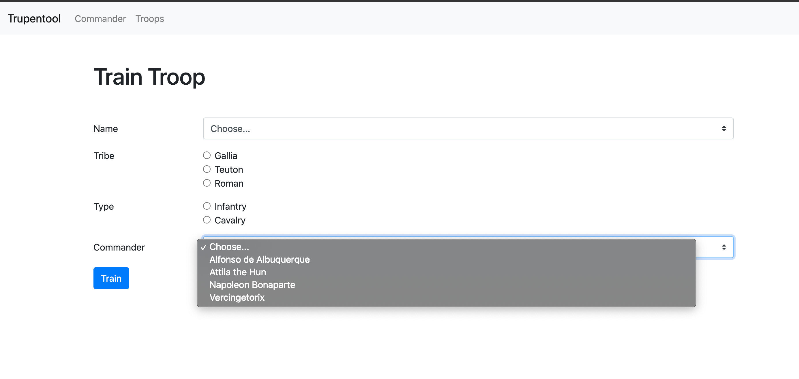

# Trupentool

⏰ estimated time: ~180 minutes

Kita kembali ke era dimana peperangan adalah bagian dari kehidupan.

Oleh karena itu, kamu diminta untuk membuat sistem untuk melatih pasukan yang nantinya mereka akan turun ke medan peperangan untuk memperjuangkan keinginan mereka. Sistem ini dibuat dengan menggunakan expressjs dan sequelize untuk dapat bekerja dengan baik.

Gunakan nama database: **trupentool**

## Release 0

Buatlah beberapa model dengan menggunakan sequelize dan spesifikasinya sebagai berikut:

1. Commander

| Column name     | type      |
|-----------------|:---------:|
| name            | string    |
| nation          | string    |
| age             | number    |
| militaryForce   | number    |

2. Troop

| Column name     | type      |
|-----------------|:---------:|
| name            | string    |
| tribe           | string    |
| type            | string    |
| attackPower     | number    |

## Release 1

Buatlah relasi antara `Commander` dengan `Troop` dimana 1 `Commander` bisa memiliki banyak `Troop` dan 1 `Troop` hanya bisa mengikuti 1 `Commander`.  
Buatlah migration baru untuk menambahkan kolom-kolom yang dibutuhkan guna memenuhi requirement tersebut.

## Release 2

Buatlah sebuah seed file untuk memasukan data ke tabel `Commander`. Datanya sebagai berikut:

| Name                   | Nation     | Age |
| ---------------------- | ---------- | --- |
| Alfonso de Albuquerque | Portuguese | 38  |
| Vercingetorix          | Gallia     | 28  |
| Napoleon Bonaparte     | French     | 39  |
| Attila the Hun         | Hungary    | 28  |

Dimana `militaryForce` awal seluruh `Commander` adalah 0

## Release 3

| Method | Route             | Deskripsi                                                              |
| :----- | :----             | :--------------------------------------------------------------------- |
| GET    | /                 | Landing page yang berisi navigasi ke route `/commanders` dan `/troops` |
| GET    | /commanders       | Menampilkan data seluruh `Commander`                                   |
| GET    | /troops           | Menampilkan data seluruh `Troop`                                       |
| GET    | /troops/train     | Form untuk menambahkan `Troop`                                         |
| POST   | /troops/train     | Menambahkan data troop ke database                                     |

## Release 4

Untuk route `GET /commanders`, tampilkan data `Commander` berupa table yang memiliki kolom seperti berikut:

- No
- Name
- Nation
- Age
- Military Force
- Count Troops

Field `Name` yang ditampilkan adalah gabungan dari `Title` dan `Name` dari `Commander`. `Title` didapatkan berdasarkan Military Force yang dimiliki masing-masing commander. 
Buatlah sebuah `getter/instance method` untuk mendapatkan `Title` dari masing-masing commander dengan ketentuan :

|                | General | Major  | Sergeant |
| -------------- | --------| ------ | -------- |
| militaryForce  | >=500   |  >=100 |  >=0     |

Field `Count Troops` merupakan `jumlah troops` dari  masing-masing `Commander` yang ada.( Gunakan Eager Loading )

## Release 5

Untuk route `GET /troops`, tampilkan data troop berupa table yang memiliki kolom seperti berikut:

- No
- Name
- Tribe
- Type
- Attack Power
- Commander Name

Untuk kolom _Commander Name_ tampilkan nama commander dari `Troop` yang bersangkutan.  
Selain menampilkan list, halaman ini juga menampilkan tombol `Train Troop` yang akan mengarahkan kita ke `/troops/train`. Tombol ini berada di atas (sebelum) table.

## Release 6

Untuk route `GET /troops/train` buatlah halaman baru yang akan menampilkan form untuk menambahkan troop baru ke database dan memiliki input sebagai berikut:

- Name (select)
- Tribe (radio button)
- Type (radio button)
- Commander (select)

Dimana _Name_ memiliki pilihan:
1. Phalanx
2. Teutonic Knight
3. Theutates Thunder
4. Equites Imperatoris

Dan _Tribe_ memiliki pilihan:
1. Gallia
2. Teuton
3. Roman

Dan _Type_ memiliki pilihan:
1. Infantry
2. Cavalry

Sedangkan untuk _Commander_ merupakan select yang optionnya didapat dari masing-masing `id` di data `Commander` yang telah kita seed sebelumnya.  
Setelah itu tambahkan button train yang akan mengarahkan kita ke `POST /troops/train`.

## Release 7

Pada route `POST /troops/train`, buatlah validasi `not-empty` di server untuk masing-masing propertinya, jika ada salah satu dari property tersebut bernilai kosong maka akan mengembalikan error dan proses penambahan troop batal dilakukan.  

> pesan error dapat di kirim melalui res.send selama pesan error yang ditampilkan jelas dan sesuai dengan error yang terjadi

Sebelum data input dimasukkan ke database, buatlah hooks untuk mengisi nilai property `attackPower` dari troop. Adapun aturan yang dikenakan adalah sebagai berikut:

|          | Gallia | Teuton | Roman |
| -------- | ------ | ------ | ----- |
| Infantry | 65     | 60     | 70    |
| Cavalry  | 140    | 150    | 180   |

Contoh:
- jika data troop yang dimasukan memiliki **tribe** _Gallia_ dan **type** _Infantry_ maka nilai dari `attackPower` nya adalah 65.

Ketika penambahan Troop ini berhasil, maka secara beruntun akan mengupdate `militaryForce` dari `Commander` yang bersangkutan. Dimana `militaryForce` nya akan bertambah sebesar `attackPower` dari `Troop` tersebut. Jika proses berhasil, maka akan diarahkan ke `/commanders`.

## Release 8

Buatlah sebuah `helper` untuk nantinya digunakan untuk mem-format military force kedalam bentuk format nominal angka. Contoh:

- `10000` menjadi `10.000`
- `150000` menjadi `150.000`
- `3000` menjadi `3.000`

Terapkanlah helper tersebut ketika menampilkan military force pada routing `/commanders`.

## Release 9
Lakukan adjustment terhadap `militaryForce` (`Release 7`) dari commander yang telah ditambakan troop nya dengan aturan sebagai berikut:
- Apabila `tribe` dari troop yang ditambahkan sama dengan `nation` dari `commander` maka nilai `attackPower` troops akan dimultiply sebesar 75% dari `attackPower` sebenarnya.
-  hasil perhitungan multiply `attackPower` dapat di bulatkan kebawah
> Contoh: Troop dengan tribe `Galia` dan type `Infantry` (65) ditambahkan ke Commander `Vercingetorix` Nation `Galia`\
> maka `militaryForce` dari commander yang akan di update menjadi\
> militaryForce += 65 * 1,75% = 113.75 dibulatkan 113

## Release 10
 Lakukan adjustment terhadap halaman List Troops `/troops` dimana dapat memfilter list troops berdasakkan `Commander` yang dipilih.
 > Data Pilihan `Commander` diambil dari database.\
 > Gunakan `req.query `untuk melakukan proses filter troop tersebut.

 

 Contoh : Route GET `/troops?CommanderId=3`

 
